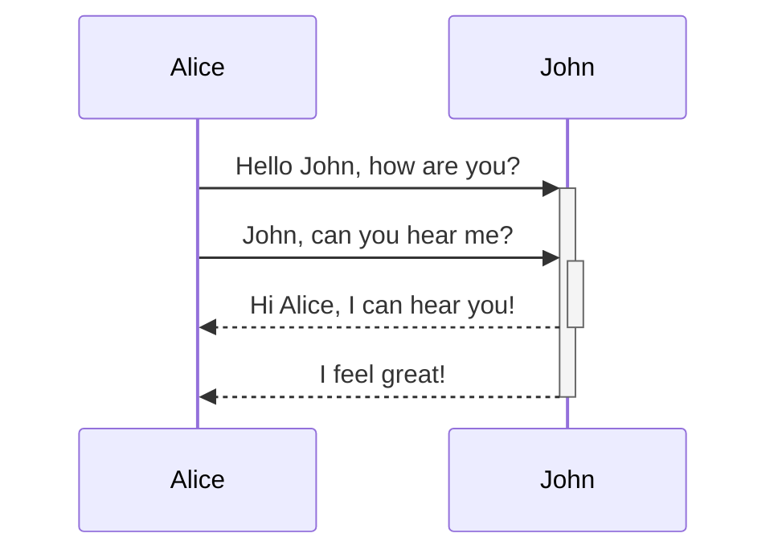

> _This is the first post for the **Y0G1TR0N series** and that damn futuristic dawg wants to talk about markdown formatting??? Ok, better work, Yogi._

## Headers
Okay, that ^^ was Header 2, so let us carry on from there...
### Header 3 
#### Header 4 
##### Header 5
###### Header 6

_Alright, not gonna lie, I don't know why I always test out them focking headers everytime I do one of these markdown test pages. I guess it's just fun, seeing the headers get more smol, hehe..._

## Quotes
> "Gardens … lie between farmland and wilderness ... The garden is farmland that delights the senses, designed for delight rather than commodity." -- [Bernstein](http://www.eastgate.com/garden/Gardens.html)

## Callouts

> [!info] LOOK BETCH
> 
> This is a callout!

> [!question]+ Can callouts be nested?
>
> > [!todo]- Yes!, they can. And collapsed!
> >
> > > [!example] You can even use multiple layers of nesting.

> [!EXAMPLE] Examples
>
> Aliases: example

> [!note] Notes
>
> Aliases: note

> [!abstract] Summaries
>
> Aliases: abstract, summary, tldr

> [!info] Info
>
> Aliases: info, todo

> [!tip] Hint
>
> Aliases: tip, hint, important

> [!success] Success
>
> Aliases: success, check, done

> [!question] Question
>
> Aliases: question, help, faq

> [!warning] Warning
>
> Aliases: warning, caution, attention

> [!failure] Failure
>
> Aliases: failure, fail, missing

> [!danger] Error
>
> Aliases: danger, error

> [!bug] Bug
>
> Aliases: bug

> [!quote] Quote
>
> Aliases: quote, cite

## Images


## LaTex syntax

### Block Math

Block math can be rendered by delimiting math expression with `$$`.

```
$$
f(x) = \int_{-\infty}^\infty
    f\hat(\xi),e^{2 \pi i \xi x}
    \,d\xi
$$
```

$$
f(x) = \int_{-\infty}^\infty
    f\hat(\xi),e^{2 \pi i \xi x}
    \,d\xi
$$

$$
\begin{aligned}
a &= b + c \\ &= e + f \\
\end{aligned}
$$

$$
\begin{bmatrix}
1 & 2 & 3 \\
a & b & c
\end{bmatrix}
$$

### Inline Math

Similarly, inline math can be rendered by delimiting math expression with a single `$`. For example, `$e^{i\pi} = -1$` produces $e^{i\pi} = -1$

### Escaping symbols

There will be cases where you may have more than one `$` in a paragraph at once which may accidentally trigger MathJax/Katex.

To get around this, you can escape the dollar sign by doing `\$` instead.

For example:

- Incorrect: `I have $1 and you have $2` produces I have $1 and you have $2
- Correct: `I have \$1 and you have \$2` produces I have \$1 and you have \$2

## Mermaid Diagrams

To add a Mermaid diagram, create a mermaid code block.

````

````


## Code Syntax Highlighting
Text inside `backticks` on a line will be formatted like code.

````
```ts
export function trimPathSuffix(fp: string): string {
  fp = clientSideSlug(fp)
  let [cleanPath, anchor] = fp.split("#", 2)
  anchor = anchor === undefined ? "" : "#" + anchor

  return cleanPath + anchor
}
```
````

```ts
export function trimPathSuffix(fp: string): string {
  fp = clientSideSlug(fp)
  let [cleanPath, anchor] = fp.split("#", 2)
  anchor = anchor === undefined ? "" : "#" + anchor

  return cleanPath + anchor
}
```

### Titles

Add a file title to your code block, with text inside double quotes (`""`):

````
```js title="..."

```
````

```ts title="quartz/path.ts"
export function trimPathSuffix(fp: string): string {
  fp = clientSideSlug(fp)
  let [cleanPath, anchor] = fp.split("#", 2)
  anchor = anchor === undefined ? "" : "#" + anchor

  return cleanPath + anchor
}
```

### Line highlighting

Place a numeric range inside `{}`.

````
```js {1-3,4}

```
````

```ts {2-3,6}
export function trimPathSuffix(fp: string): string {
  fp = clientSideSlug(fp)
  let [cleanPath, anchor] = fp.split("#", 2)
  anchor = anchor === undefined ? "" : "#" + anchor

  return cleanPath + anchor
}
```

### Word highlighting

A series of characters, like a literal regex.

````
```js /useState/
const [age, setAge] = useState(50);
const [name, setName] = useState('Taylor');
```
````

```js /useState/
const [age, setAge] = useState(50)
const [name, setName] = useState("Taylor")
```

### Line numbers

Syntax highlighting has line numbers configured automatically. If you want to start line numbers at a specific number, use `showLineNumbers{number}`:

````
```js showLineNumbers{number}

```
````

```ts showLineNumbers{20}
export function trimPathSuffix(fp: string): string {
  fp = clientSideSlug(fp)
  let [cleanPath, anchor] = fp.split("#", 2)
  anchor = anchor === undefined ? "" : "#" + anchor

  return cleanPath + anchor
}
```

### Escaping code blocks

You can format a codeblock inside of a codeblock by wrapping it with another level of backtick fences that has one more backtick than the previous fence.

`````
````
```js /useState/
const [age, setAge] = useState(50);
const [name, setName] = useState('Taylor');
```
````
`````
